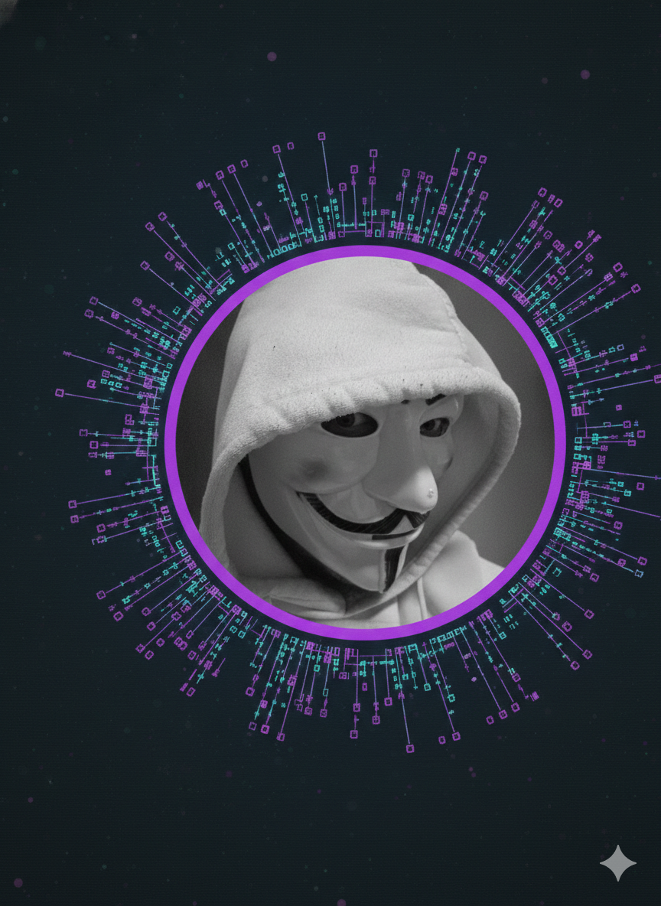

  

###

 

  

  <h1>Hey there, I'm Kevin 👋</h1>
  
  

    <strong>Founder of Team .EXE | Fullstack Developer in Training | Tech Enthusiast</strong>
  

  

    <a href="https://ktriebe.xyz">🌐 Personal Website</a> •
  

---

### 🚀 About Me

I am Kevin, the founder of **Team .EXE**. Currently, I am a full-stack development student at the **Developer Akademie**, where I am undergoing an intensive 12-month training program to master modern web technologies. My goal is to create high-performance web applications and push the boundaries of digital experiences.

* 🔭 **Current Focus:** Developing [ktriebe.xyz](https://ktriebe.xyz) and growing the Team .EXE community.
* 🎓 **Education:** 12-month Full-stack boot camp (HTML, CSS, JavaScript, React, Backend).
* 🛠️ **Background:** Proficient in **Lua** scripting and 3D modeling with **Blender**.
* ⚡ **Fun Fact:** When I'm not coding, I'm likely managing my team or working on 3D designs.

---

### 🛠️ Tech Stack

#### Web Development (Learning)

  
  
  
  

#### Scripting & 3D (Mastered)

  
  

---

### 📱 Socials

  
  
  

###

  

###
